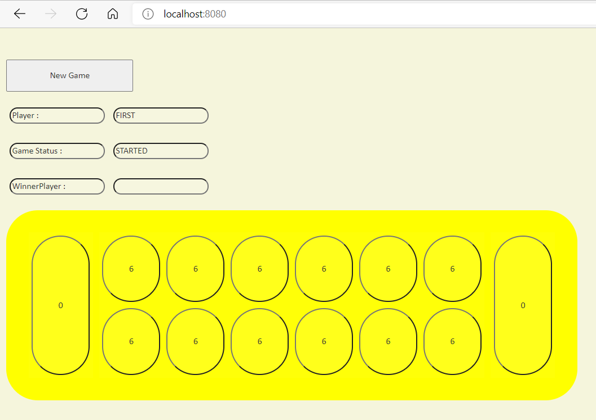
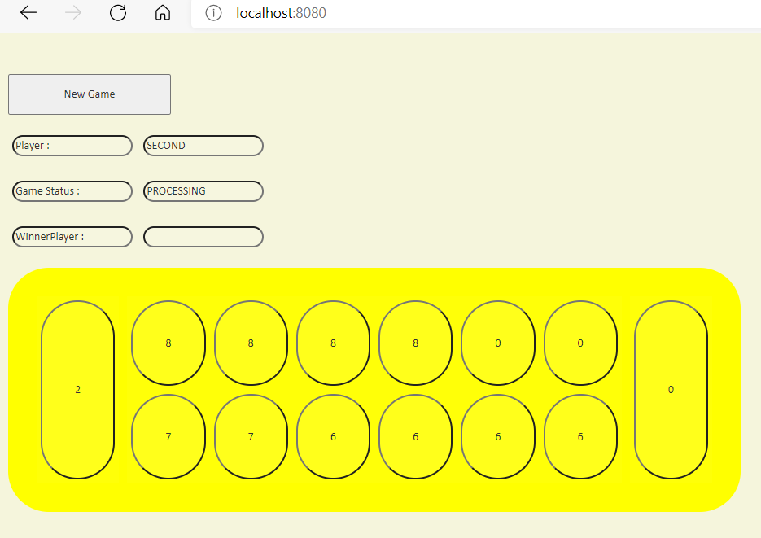
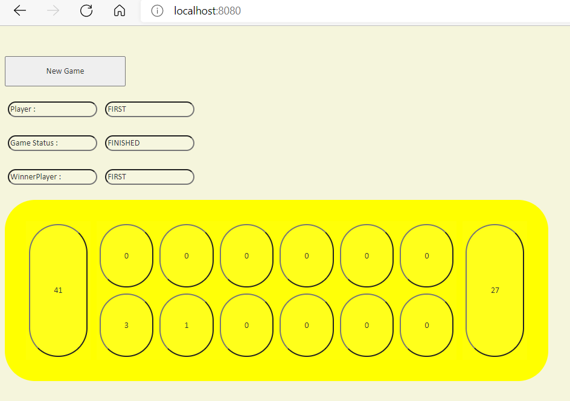

# Mancala Game for bol.com

This application implements backend and frontend Mancala Game.It is a strategy game played by default with 2 players, 6 pits and 6 stones. The user can play the game with as many stones and pits as he/she wants.
It is a Springboot application. In the design of the application architecture, the application design was made by taking 12 factors as reference. 
  
## Technical Stack
   
    * Java 11
    * Springboot 2.5.4
    * Redis  Key-Value in-memory data structure for caching
	* Jeasy for Rule Engine
	* Logback for logging
    * Docker for containerization of services
    * Maven 3.6.3
    * Lombok
	* ModelMapper for object mapping
    * Swagger 2 API documentation
    * Junit for TDD
	* Single Responsibilities
	* Rest Service Standarts
	* Singleton Pattern

## Tasks
    - Setup project properly from spring initialzr.
	- Get enough content about the game.
	- Make a design for domain.
	- Start implementation with tests and TDD.
	   - set model
	   - set operations
	   - set rules
	- Add Rest API with controllers.
	- Add Controller Advice for exception handling.
	- Create Annotation for validation.
	- Add Rule Manager.
	- Add Redis configuration for caching some data.
	

# Getting Started

## Installation
  
   1. Clone the repo
   
     https://gitlab.com/bolcom/kubra-cambaz.git
     
   2. Import project in IntellJ IDEA
   
   3. Choose the Spring Boot Application file (search for @SpringBootApplication)
   
   4. Right Click on the file and Run as Java Application
   
## Building from source and Run Project
    
    mvn clean install
    java -jar target/mancalagame-0.0.1-SNAPSHOT.jar


## Running with docker

  `docker-compose up --build`

## Usage

There are 2 API's in this Project.

* `/mancala/games`

  This API provides to create new game. It accepts HTTP POST request. The user does not have to play with the default number of pits and stones. The user can create the game by specifying the number of pits and stones.  

  When "New Game" button is clicked board is set. Pits are filled with stones. It is easy to start.
  

  Sample request body for create games:
    ```
    {
      "pitCount": 4,
	  "stoneCount": 4
	  
    }
    ```

* `/mancala/plays`

  This API provides to sow specific pit index. It accepts HTTP PUT request .
  
  When pits button is clicked stones are sowed and rules are run. Player turn can change.
  

  Sample request body for play:
    ```
    {
      "firstPlayer": {
	      "largePit": 4,
		  "playerType": "FIRST"
	   },
	  "secondPlayer": {
	      "largePit": 9,
		  "playerType": "SECOND"
	  },
	  "pits": [4,4,4,4,0,4,4,4,4,0],
	  "playerTurn": "FIRST",
	  "index": 1,
	  "status": "STARTED"
    }
    ```
  
  When the game finish,game status is set as "FINISHED" and winner player is set on the screen.
  


## Test on the browser via SWAGGER

  http://localhost:8080/swagger-ui.html#/game-controller
  
## Authors
- Kübra Cambaz

